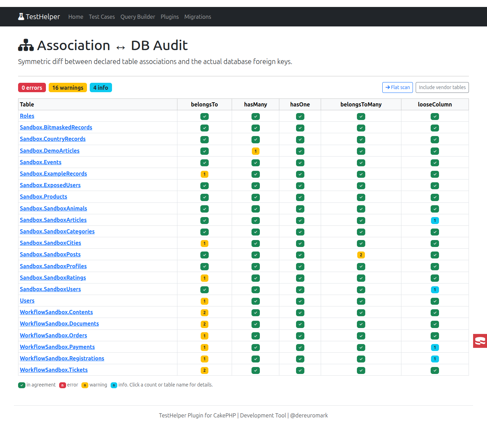
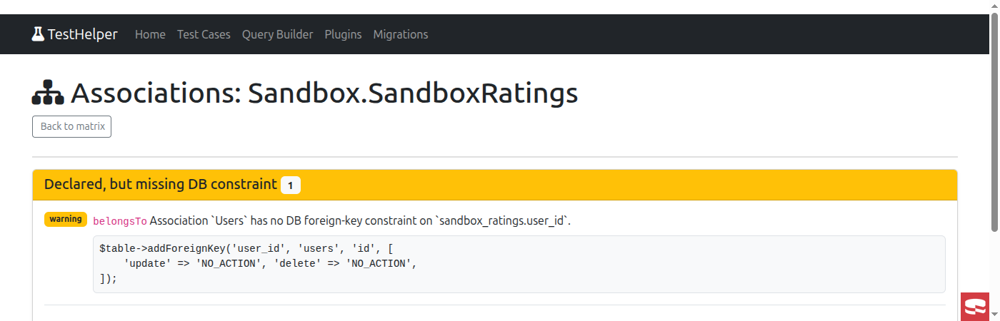
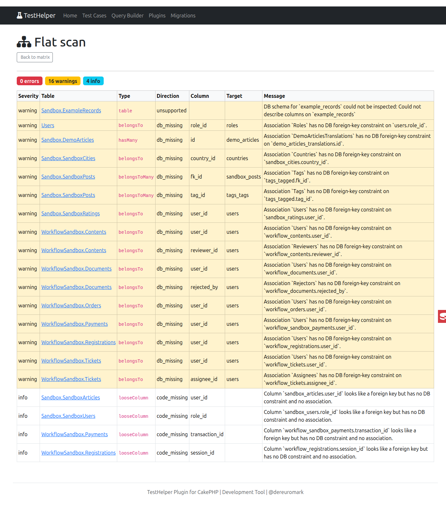

# Association vs DB Foreign-Key Audit

Navigate to:

```
/test-helper/associations
```

Audits whether your declared table associations (`belongsTo`, `hasMany`, `hasOne`,
`belongsToMany`) agree with the actual database foreign keys, in both directions, and
flags a few related consistency problems. It is **read-only** — it never changes your
schema or code, only suggests copy-paste fixes.

App and first-party plugin tables are scanned by default; vendor tables can be folded in
via the toggle on the matrix page.

## What it checks

The audit runs in four layers.

### Constraint layer (the core diff)

A symmetric diff between the foreign keys your associations imply and the foreign keys that
actually exist in the database:

* an association whose owner **column does not exist at all** — an **error**; suggests an `addColumn()` migration line (a foreign key cannot be placed on a missing column)
* an association whose column exists but has **no matching DB foreign-key constraint** — a **warning**; suggests an `addForeignKey()` migration line
* a **DB foreign key with no matching association** — suggests the `belongsTo`/`hasMany` call
* a **target/column disagreement** between the two (the association points somewhere the DB FK does not) — an **error**

### Key-type layer

Compares each foreign-key column's type against the referenced (primary) key's type:

* a **cross-type mismatch** (e.g. `integer` referencing `uuid`) is an **error** and suggests a `changeColumn()` migration line that aligns the column to its target
* an **owner key narrower than the referenced key** (e.g. an `integer` FK referencing a `biginteger` primary key) is a **warning** — it cannot hold every referenced value (same `changeColumn()` fix); a wider or equal owner is fine
* **matching non-integer keys** (e.g. both `uuid`) are reported as **info**, since integer keys are generally preferred

Set `TestHelper.associationAudit.preferIntegerKeys` to `false` to silence the non-integer
info advisory in uuid-first apps (the cross-type error and narrowing warning are always
reported).

> [!NOTE]
> The key-type layer only applies to single-column foreign keys. Composite keys are still
> diffed structurally but not type-checked.

### Cascade-rule layer

Compares the ORM `dependent` intent of a `hasMany`/`hasOne` against the matching DB foreign
key's `ON DELETE` rule (reported as **info**, since either side can legitimately own the
cascade):

* a `dependent` association whose DB FK uses `ON DELETE NO ACTION` won't cascade a delete issued **directly in SQL** (outside the ORM) — suggests a migration switching the FK to `ON DELETE CASCADE` (preserving the existing `ON UPDATE` rule)
* a DB `ON DELETE CASCADE` with a **non-`dependent`** association means rows the DB removes won't fire ORM callbacks — suggests adding `'dependent' => true, 'cascadeCallbacks' => true` (both are needed; `dependent` alone uses a bulk `deleteAll()` that skips child callbacks)

`ON UPDATE` has no ORM-level equivalent and is not compared.

### Loose-column layer

Flags `*_id` columns that have **neither** a foreign-key constraint **nor** an association
(reported as **info**). The built-in ignore list covers common polymorphic columns
(`foreign_id`, `parent_id`, `related_id`); extend it via
`TestHelper.associationAudit.ignoreColumns`.

## Composite foreign keys

Multi-column (composite) foreign keys are fully diffed in the constraint layer — both for
`belongsTo`/`hasMany`/`hasOne` and for `belongsToMany` junctions. Fix snippets render the
columns as arrays and pin a non-default `bindingKey`, e.g.:

``` php
$table->addForeignKey(['tenant_id', 'company_id'], 'companies', ['tenant_id', 'id'], [
    'update' => 'NO_ACTION', 'delete' => 'NO_ACTION',
]);
```

A composite association whose foreign-key columns and binding columns do not line up is
reported as "not auto-verifiable" rather than guessed at.

## The matrix

The summary matrix shows every table against each association type plus the two
cross-cutting layers (`Key type` and `Cascade`) as their own columns, color-coded by status:



Each finding can be opened for detail, grouped by direction, including a copy-paste fix:



## The flat scan

A flat scan lists every finding across all in-scope tables at once, ordered worst-first
(errors, then warnings, then info) and grouped by table within each severity. Topic chips
at the top (Constraints, Columns, Key types, Not verifiable) toggle whole categories of
finding in or out, so you can mute, say, the not-verifiable noise and focus on real
constraint problems:



## Configuration

| Key | Default | Description |
|-----|---------|-------------|
| `TestHelper.associationAudit.ignoreColumns` | `[]` | Extra `*_id` column names to ignore in the loose-column layer (merged with the built-in polymorphic defaults). |
| `TestHelper.associationAudit.preferIntegerKeys` | `true` | When `false`, suppress the "integer keys are preferred" info advisory. Cross-type mismatches and narrowing warnings remain. |

See `config/config.dist.php` for the canonical reference.

## Limitations

* `ON UPDATE` rules are captured but not compared (no ORM equivalent).
* Composite foreign keys are diffed structurally but not type-checked.
* A same-named table on a non-default connection cannot be disambiguated from its alias alone when drilling into the detail view.
