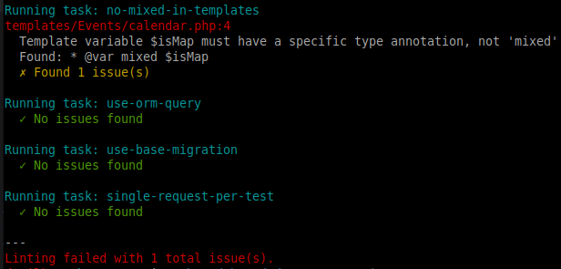

# Cake Linter Tasks

The TestHelper plugin provides a flexible linter system for running project-specific code quality checks. Unlike general-purpose tools (phpcs, phpstan, rector), these linters are designed for quick validation of project-specific conventions that don't fit into standard static analysis tools.



## Why Linter Tasks?

* **Cake rules**: Enforce CakePHP conventions and best practices (plugin based tasks)
* **Project-specific rules**: Enforce conventions unique to your codebase (extension level)
* **Fast execution**: Simple checks that run in seconds
* **Easy to extend**: Create custom tasks without complex tool configuration
* **Integration-friendly**: Can be run in CI pipelines alongside other quality tools

## Usage

### Basic Commands

Run all available linter tasks:
```bash
bin/cake linter
```

List available tasks:
```bash
bin/cake linter --list
```

Run a specific task:
```bash
bin/cake linter --task use-orm-query
```

Check specific paths:
```bash
bin/cake linter src/,tests/
```

Check a specific plugin:
```bash
bin/cake linter --plugin Board
bin/cake linter -p Board
```

Check all loaded plugins:
```bash
bin/cake linter --plugin all
bin/cake linter -p all
```

Check plugins with wildcard pattern:
```bash
bin/cake linter --plugin "My*"      # Match MyPlugin, MyOtherPlugin, etc.
bin/cake linter -p "*Helper"        # Match IdeHelper, TestHelper, etc.
```

Show paths being checked and use absolute file paths (verbose mode):
```bash
bin/cake linter -v
```

Verbose mode shows:
* Paths being checked
* Full absolute file paths instead of relative paths (for better terminal/CLI clickability)
* Which plugin(s) are being checked when using `--plugin` option

### Plugin Mode

Check specific plugins or all loaded plugins:

```bash
# Check a specific plugin
bin/cake linter --plugin Board

# Check all loaded plugins
bin/cake linter --plugin all

# Combine with task filter
bin/cake linter --plugin Board --task duplicate-template-annotations

# Combine with verbose mode
bin/cake linter -p all -v
```

**How it works:**
* Each task's default paths are prefixed with the plugin directory
* Example: For plugin `Board`, if a task checks `templates/` and `src/Controller/`, it will check:
  - `plugins/Board/templates/`
  - `plugins/Board/src/Controller/`
* `--plugin PluginName` checks one specific plugin
* `--plugin all` checks all loaded app plugins (excludes vendor plugins)
* `--plugin "Pattern*"` uses wildcard matching with `fnmatch()` (e.g., `"My*"`, `"*Helper"`)
* Only app plugins are included - vendor plugins are automatically excluded
* If a plugin is not loaded or pattern matches nothing, shows error with available plugins
* Tasks can opt-out of plugin mode by returning `false` from `supportsPluginMode()` - they will be skipped when `--plugin` is used

### Auto-Fix Mode

Some linter tasks support automatic fixing of detected issues:

```bash
bin/cake linter --fix
```

Run auto-fix on a specific task:
```bash
bin/cake linter --task array-urls-in-tests --fix
```

See task list below to see which tasks support auto-fix

### CI Mode

For running in CI environments where test database connections are configured:

```bash
bin/cake linter --ci
```

This enables CI mode which aliases test database connections (e.g., `test` to `default`, `test_custom` to `custom`) to ensure the linter works correctly in CI pipelines where only test databases are available.

### Exit Codes

* `0` - All checks passed, no issues found
* `1` - Issues were found

## Included Default Tasks

The plugin includes nine default linter tasks that are active by default:

### array-urls-in-controllers

Checks controller files for string URLs in `redirect()` - enforces array format.

* **Checks:** `src/Controller/` directory
* **Purpose:** Enforce CakePHP routing array format instead of string URLs in controllers
* **Auto-fix:** ✅ Supported (simple URLs only)

**Example violation:**
```php
return $this->redirect('/dashboard/index');
return $this->redirect('/articles/index?status=published');
```

**Auto-fixed to:**
```php
return $this->redirect(['controller' => 'Dashboard', 'action' => 'index']);
return $this->redirect(['controller' => 'Articles', 'action' => 'index', '?' => ['status' => 'published']]);
```

**Limitation:** Concatenated URLs (e.g., `$this->redirect('/path/' . $variable)` or `$this->redirect('/path?id=' . $user->id)`) are not auto-fixable and will be skipped to avoid breaking code. These need to be manually converted.

### array-urls-in-tests

Checks test files for string URLs in `get()`, `post()`, and `assertRedirect()` - enforces array format.

* **Checks:** `tests/TestCase/Controller/` directory
* **Purpose:** Enforce CakePHP routing array format instead of string URLs in tests
* **Auto-fix:** ✅ Supported (simple URLs only)

**Example violation:**
```php
$this->get('/suppliers/view/123');
$this->post('/users/login?user=x');
$this->assertRedirect('/dashboard/index');
```

**Auto-fixed to:**
```php
$this->get(['controller' => 'Suppliers', 'action' => 'view', 123]);
$this->post(['controller' => 'Users', 'action' => 'login', '?' => ['user' => 'x']]);
$this->assertRedirect(['controller' => 'Dashboard', 'action' => 'index']);
```

**Limitation:** Concatenated URLs (e.g., `$this->get('/path/' . $variable)` or `$this->assertRedirect('/path?param=' . $value)`) are not auto-fixable and will be skipped to avoid breaking code. These need to be manually converted.

### deprecated-find-options

Detects deprecated `$options` array in `find()` calls - use named parameters instead.

* **Checks:** `src/`, `tests/` directories
* **Purpose:** Enforce spread operator for find() options in CakePHP 5.x
* **Auto-fix:** ✅ Supported

**Example violation:**
```php
$query->find('all', $options);
$query->find('list', ['conditions' => ['active' => true]]);
```

**Auto-fixed to:**
```php
$query->find('all', ...$options);
$query->find('list', ...['conditions' => ['active' => true]]);
```

### duplicate-template-annotations

Detects duplicate `@var` annotations for the same variable in template files.

* **Checks:** `templates/` directory
* **Purpose:** Prevent duplicate variable annotations that can cause confusion and inconsistencies

**Example violation:**
```php
<?php
/**
 * @var array<\Tickling\Model\Entity\TicklishSpot> $ticklishSpots
 * @var mixed $ticklishSpots
 */
?>
```

**Should be:**
```php
<?php
/**
 * @var array<\Tickling\Model\Entity\TicklishSpot> $ticklishSpots
 */
?>
```

### no-mixed-in-templates

Ensures template variables have specific type annotations, not `mixed`.

* **Checks:** `templates/` directory
* **Purpose:** Enforce proper type hints in template files for better IDE support and type safety

**Example violation:**
```php
<?php
/**
 * @var mixed $user
 */
?>
```

**Should be:**
```php
<?php
/**
 * @var \App\Model\Entity\User $user
 */
?>
```

### use-orm-query

Checks for incorrect generic Query imports which should use specific query types like `SelectQuery`

* **Checks:** `src/`, `tests/` directories
* **Purpose:** Enforce specific Query class imports for CakePHP 5.x

**Example violations:**
```php
use Cake\Database\Query;
use Cake\ORM\Query;
```

**Should be:**
```php
use Cake\ORM\Query\SelectQuery;
```

Note: Not auto-fixed here, if found, use [upgrade tool](https://github.com/cakephp/upgrade) to auto-fix.

### use-base-migration

Flags deprecated `AbstractMigration` and `AbstractSeed` usage, recommending `BaseMigration` and `BaseSeed`

* **Checks:** `config/Migrations/`, `config/Seeds/` directories
* **Purpose:** Ensure migrations use non-deprecated base classes

**Example violation:**
```php
use Migrations\AbstractMigration;

class CreateUsersTable extends AbstractMigration
```

**Should be:**
```php
use Migrations\BaseMigration;

class CreateUsersTable extends BaseMigration
```

Note: Not auto-fixed here, if found, use [upgrade tool](https://github.com/cakephp/upgrade) to auto-fix.

### single-request-per-test

Validates that controller test methods contain only one `get()` or `post()` call

- **Checks:** `tests/TestCase/Controller/` directory
- **Purpose:** Enforce test isolation - each test method should test a single request

**Example violation:**
```php
public function testUserFlow(): void
{
    $this->get('/users/login');
    $this->post('/users/login', ['username' => 'test']);  // Second request - violation!
}
```

**Should be:**
```php
public function testLoginPage(): void
{
    $this->get('/users/login');
}

public function testLoginSubmit(): void
{
    $this->post('/users/login', ['username' => 'test']);
}
```

### post-link-within-forms

Detects `postLink()` calls within `<form>` tags and ensures `block => true` parameter is set to prevent nested forms.

* **Checks:** `templates/` directory
* **Purpose:** Prevent HTML validation errors from nested forms
* **Auto-fix:** ✅ Supported

**Example violation:**
```php
<?= $this->Form->create($entity) ?>
    <?= $this->Form->postLink('Delete', ['action' => 'delete', $entity->id]) ?>
<?= $this->Form->end() ?>
```

**Auto-fixed to:**
```php
<?= $this->Form->create($entity) ?>
    <?= $this->Form->postLink('Delete', ['action' => 'delete', $entity->id], ['block' => true]) ?>
<?= $this->Form->end() ?>
```

**Why this matters:** By default, `postLink()` generates its own `<form>` element. When used inside another form, this creates invalid nested forms. Setting `'block' => true` makes `postLink()` output the form to a view block instead, which prevents nesting issues.

## Creating Custom Tasks

### Step 1: Create Task Class

Create your linter task in `src/Command/Linter/Task/`:

```php
<?php
declare(strict_types=1);

namespace App\Command\Linter\Task;

use Cake\Console\ConsoleIo;
use TestHelper\Command\Linter\AbstractLinterTask;

class MyCustomTask extends AbstractLinterTask
{
    /**
     * Task name (used for --task option)
     */
    public function name(): string
    {
        return 'my-custom-task';
    }

    /**
     * Task description (shown in --list)
     */
    public function description(): string
    {
        return 'Check for custom project conventions';
    }

    /**
     * Default paths to check
     */
    public function defaultPaths(): array
    {
        return ['src/', 'tests/'];
    }

    /**
     * Whether this task supports auto-fix (optional, defaults to false)
     */
    public function supportsAutoFix(): bool
    {
        return true; // Set to true if your task can auto-fix issues
    }

    /**
     * Whether this task can run in plugin mode (optional, defaults to true)
     */
    public function supportsPluginMode(): bool
    {
        return false; // Set to false if task should only run at app level
    }

    /**
     * Run the linter task
     *
     * @param \Cake\Console\ConsoleIo $io Console IO
     * @param array<string, mixed> $options Options including paths, fix mode
     * @return int Number of issues found
     */
    public function run(ConsoleIo $io, array $options = []): int
    {
        $paths = $options['paths'] ?? $this->defaultPaths();
        $files = $this->getFiles($paths, '*.php');
        $verbose = $options['verbose'] ?? false;
        $fix = $options['fix'] ?? false; // Check if auto-fix is enabled
        $issues = 0;

        foreach ($files as $file) {
            $content = file_get_contents($file);
            if ($content === false) {
                continue;
            }

            // Your custom validation logic here
            $lines = explode("\n", $content);
            $modified = false;

            foreach ($lines as $lineNumber => $line) {
                // Example: Check for TODO comments
                if (preg_match('/TODO:/i', $line)) {
                    $this->outputIssue(
                        $io,
                        $file,
                        $lineNumber + 1,
                        'TODO comment found',
                        trim($line),
                        $verbose
                    );
                    $issues++;

                    // Auto-fix example: Remove TODO comments
                    if ($fix) {
                        $lines[$lineNumber] = preg_replace('/TODO:/i', 'DONE:', $line);
                        $modified = true;
                        $io->verbose('  Fixed: ' . trim($lines[$lineNumber]));
                    }
                }
            }

            // Write back to file if modified
            if ($modified) {
                file_put_contents($file, implode("\n", $lines));
            }
        }

        return $issues;
    }
}
```

### Step 2: Register Task (Optional)

Tasks in `App\Command\Linter\Task\` are **not** auto-discovered. You must register them in configuration:

```php
// config/app.php
return [
    'TestHelper' => [
        'Linter' => [
            'tasks' => [
                \App\Command\Linter\Task\MyCustomTask::class,
            ],
        ],
    ],
];
```

### Step 3: Run Your Task

```bash
bin/cake linter --task my-custom-task
```

## Configuration

Configure tasks in `config/app.php`:

```php
return [
    'TestHelper' => [
        'Linter' => [
            'tasks' => [
                // Add custom tasks (simple list)
                \App\Command\Linter\Task\MyCustomTask::class,
                \App\Command\Linter\Task\AnotherTask::class,

                // Disable default tasks (associative array with false)
                \TestHelper\Command\Linter\Task\UseOrmQueryTask::class => false,
                \TestHelper\Command\Linter\Task\SingleRequestPerTestTask::class => false,
            ],
        ],
    ],
];
```

### Configuration Behavior

* **Default tasks** are always loaded unless explicitly disabled with `=> false`
* **Custom tasks** must be registered to be available
* **Simple list format** (`[Task::class]`) adds tasks
* **Associative format** (`[Task::class => false]`) disables tasks

## Helper Methods

The `AbstractLinterTask` base class provides helpful methods:

### getFiles()

Scan directories for files matching a pattern:

```php
$files = $this->getFiles(['src/', 'tests/'], '*.php');
```

### outputIssue()

Report an issue with file path, line number, and context:

```php
$this->outputIssue(
    $io,
    $file,          // File path
    $lineNumber,    // Line number (1-indexed, use 0 if no line is possible to set)
    'Issue description',
    'Code context',  // Optional: the problematic code
    $verbose,       // Optional: whether to show full absolute paths (from options)
);
```

## Advanced Examples

### Checking for Deprecated Functions

```php
public function run(ConsoleIo $io, array $options = []): int
{
    $paths = $options['paths'] ?? $this->defaultPaths();
    $files = $this->getFiles($paths, '*.php');
    $issues = 0;

    $deprecated = [
        'mysql_query',
        'ereg',
        'split',
    ];

    foreach ($files as $file) {
        $content = file_get_contents($file);
        $lines = explode("\n", $content);

        foreach ($lines as $lineNum => $line) {
            foreach ($deprecated as $func) {
                if (preg_match("/\b{$func}\s*\(/", $line)) {
                    $this->outputIssue(
                        $io,
                        $file,
                        $lineNum + 1,
                        "Deprecated function '{$func}' found",
                        trim($line)
                    );
                    $issues++;
                }
            }
        }
    }

    return $issues;
}
```

### Checking File Naming Conventions

```php
public function run(ConsoleIo $io, array $options = []): int
{
    $paths = $options['paths'] ?? $this->defaultPaths();
    $files = $this->getFiles($paths, '*.php');
    $issues = 0;

    foreach ($files as $file) {
        $basename = basename($file, '.php');

        // Controller files must end with "Controller"
        if (str_contains($file, '/Controller/') && !str_ends_with($basename, 'Controller')) {
            $this->outputIssue(
                $io,
                $file,
                1,
                "Controller file must end with 'Controller' suffix",
                "Found: {$basename}.php"
            );
            $issues++;
        }
    }

    return $issues;
}
```

### Validating Documentation

```php
public function run(ConsoleIo $io, array $options = []): int
{
    $paths = $options['paths'] ?? $this->defaultPaths();
    $files = $this->getFiles($paths, '*.php');
    $issues = 0;

    foreach ($files as $file) {
        $content = file_get_contents($file);

        // Find all public methods
        preg_match_all('/public function (\w+)\(/', $content, $matches, PREG_OFFSET_CAPTURE);

        foreach ($matches[1] as $match) {
            $methodName = $match[0];
            $position = $match[1];

            // Check if there's a docblock before this method
            $beforeMethod = substr($content, 0, $position);
            if (!preg_match('/\/\*\*.*?\*\/\s*$/s', $beforeMethod)) {
                $line = substr_count($beforeMethod, "\n") + 1;
                $this->outputIssue(
                    $io,
                    $file,
                    $line,
                    "Public method '{$methodName}()' missing docblock",
                );
                $issues++;
            }
        }
    }

    return $issues;
}
```

## Integration with CI/CD

Add to your CI pipeline to enforce code quality:

```yaml
# Run for app and all plugins/*
- name: Run Linter
  run: bin/cake linter --ci && bin/cake linter --ci -p all
```

The `--ci` flag ensures test database connections are properly aliased for CI environments.

And for developers as quick-check in composer scripts:

```json
{
    "scripts": {
        "check": [
            "phpcs",
            "phpstan",
            "bin/cake linter"
            "bin/cake linter -p all"
        ],
        "lint": [
            "bin/cake linter",
            "bin/cake linter -p all"
        ],
    }
}
```

## Troubleshooting

### Task Not Found

If you get "Task not found", ensure:
1. Task class is registered in `TestHelper.Linter.tasks` config
2. Task implements `LinterTaskInterface`
3. Task is in correct namespace

### No Files Checked

If verbose mode shows no files:
```bash
bin/cake linter -v
```

Check that:
1. Default paths exist in your project
2. Paths are correct (relative to ROOT)
3. File pattern matches files (`*.php` by default)

### Performance Issues

If linting is slow:
* Limit paths checked: `bin/cake linter src/Controller/`
* Check fewer files with specific task: `--task single-request-per-test`
* Consider caching results or running specific tasks in CI

## Best Practices

1. **Keep tasks focused**: Each task should check one specific thing
2. **Provide context**: Use `outputIssue()` with code context for better debugging
3. **Use verbose mode**: Document paths in verbose output
4. **Fast execution**: Aim for tasks that complete in seconds
5. **Clear names**: Use descriptive task names (`use-orm-query`, not `query-check`)
6. **Document rules**: Add clear descriptions explaining what each task checks
7. **Test your tasks**: Write unit tests for custom linter tasks
8. **CI integration**: Run linters in CI to catch issues early

## See Also

* [Main README](../README.md)
* [PHPStan](https://phpstan.org/) - For complex static analysis
* [Rector](https://github.com/rectorphp/rector) - For complex migration tooling
