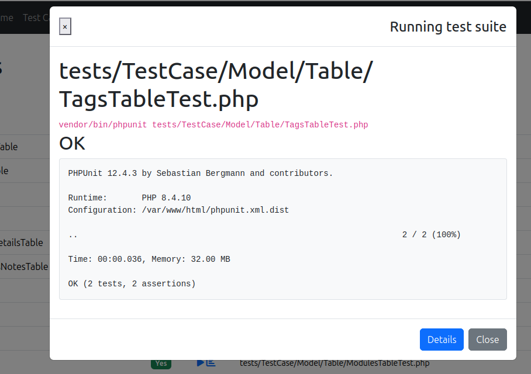

# TestHelper Plugin Documentation

Browse `/test-helper` to see all functionality available.
* [SQL to Query Builder Converter](SqlConverter.md) - Convert raw SQL to CakePHP Query Builder code
* URL generation and reverse lookup
* Check plugin hooks
* Check fixtures against tables (+ bake missing ones via click)
* Check tests per file available (+ bake missing ones via click)
* Run tests and display results or coverage in backend.
* [Custom Linter Tasks](Linter.md) - Project-specific code quality checks

## Configuration

### Your own template
The default template ships with bootstrap (5) and fontawesome icons.
You can switch out the view templates with your own on project level as documented in the CakePHP docs.

## Test Runner
Select the app or plugins, the type of classes you want to test and then click on the "run icon" to test.
If there is no test file yet, there should be a "add icon" to click which bakes one for you.

### Configuration
- **TestHelper.command**: If you need a custom phpunit command to run with. Both `php phpunit.phar` and `vendor/bin/phpunit` work out of the box.
- **TestHelper.coverage**: Set to `xdebug` if you have this enabled, it otherwise uses pcov by default.




## Other tools

### SQL to Query Builder Converter

Navigate to `/test-helper/query-builder` to access the SQL converter.

This powerful tool converts raw SQL queries into clean, production-ready CakePHP Query Builder code. It supports:

* **All Query Types**: SELECT, INSERT, UPDATE, DELETE
* **String Functions**: CONCAT, SUBSTRING, TRIM, UPPER, LOWER, COALESCE, LENGTH, REPLACE
* **Date Functions**: NOW, YEAR, MONTH, DAY, DATE_FORMAT, DATEDIFF, DATE_ADD, DATE_SUB
* **Aggregate Functions**: COUNT, SUM, AVG, MIN, MAX, GROUP_CONCAT
* **Advanced SQL**: CASE expressions, subqueries (recursive), window functions, CTEs (WITH clause)
* **Complex JOINs**: INNER, LEFT, RIGHT with AND/OR conditions
* **Bulk Operations**: Multiple row INSERT, multi-table UPDATE

**Features:**
* Syntax highlighting for both SQL input and PHP output
* Tabbed interface for easy navigation between generated code and debug info
* Categorized examples (SELECT, INSERT, UPDATE, DELETE, Advanced)
* One-click "Try It" buttons to test examples
* Copy to clipboard functionality

**Example Workflow:**
1. Paste your SQL query into the form
2. Click "Convert to CakePHP"
3. Review the generated Query Builder code with syntax highlighting
4. Copy the code to your project
5. Try the provided examples to learn different SQL patterns

See [SQL Converter Documentation](SqlConverter.md) for complete guide, examples, and detailed feature list.

### URL array generation from string URLs
Check the backend entry page for the form to make reverse lookups for URL strings.


### Plugin info/check
Check your own plugins on hooks and more.
It can also auto suggest you some improvements here.

Navigate to
```
/test-helper/plugins
```
for details.

### Custom Linter Tasks

Run project-specific code quality checks:

```
bin/cake linter
```

See [Linter Documentation](Linter.md) for complete details on:
* Creating custom linter tasks
* Configuration options
* Included default tasks
* Advanced examples

### Fixture validation tool

Note: Deprecated - Use [Fixture Factories](https://github.com/dereuromark/cakephp-fixture-factories) instead.

Compare actual DB with the schema files: fields and attributes, constraints and indexes.
It will also give you a list of bake commands you need to update the outdated fixtures.

```
bin/cake fixture_check
```

Most useful options:
* 'p': Plugin
* 't': Type to run: fields, constraints, indexes (none = all).
* 'c': Connection (you can switch from default DB to also another one)
* 'f': Specific fixtures to check (comma separated list)
* 's': Strict mode, includes collation

By default it will only check your app level. You can use a combined composer command for convenience to check also your important plugins as convenience wrapper:
```json
"scripts": {
    ...
    "fixture_check": [
        "bin/cake fixture_check",
        "bin/cake fixture_check -p MyPlugin"
    ]
}
```
Then run it as `composer fixture_check`.


## Troubleshooting

### Authorization Plugin Errors

If you are using the [CakePHP Authorization plugin](https://github.com/cakephp/authorization) and encounter `AuthorizationRequiredException` errors when accessing TestHelper routes, add this to your `config/bootstrap.php`:

```php
Configure::write('TestHelper.ignoreAuthorization', true);
```

This will skip authorization checks for all TestHelper routes, similar to how DebugKit handles authorization.

### Generated code coverage is black&white
If the assets don't work, make sure your Nginx/Apache (like CakeBox Vagrant VM by default) doesn't block hidden files.

In your /sites-available/ configuration find and remove the following for your local development:

    # deny access to hidden
    location ~ /\. {
        deny all;
    }

Afterwards your coverage should be colorful.
