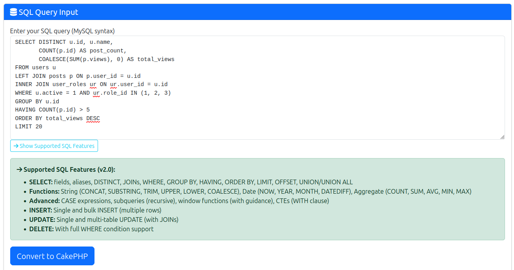
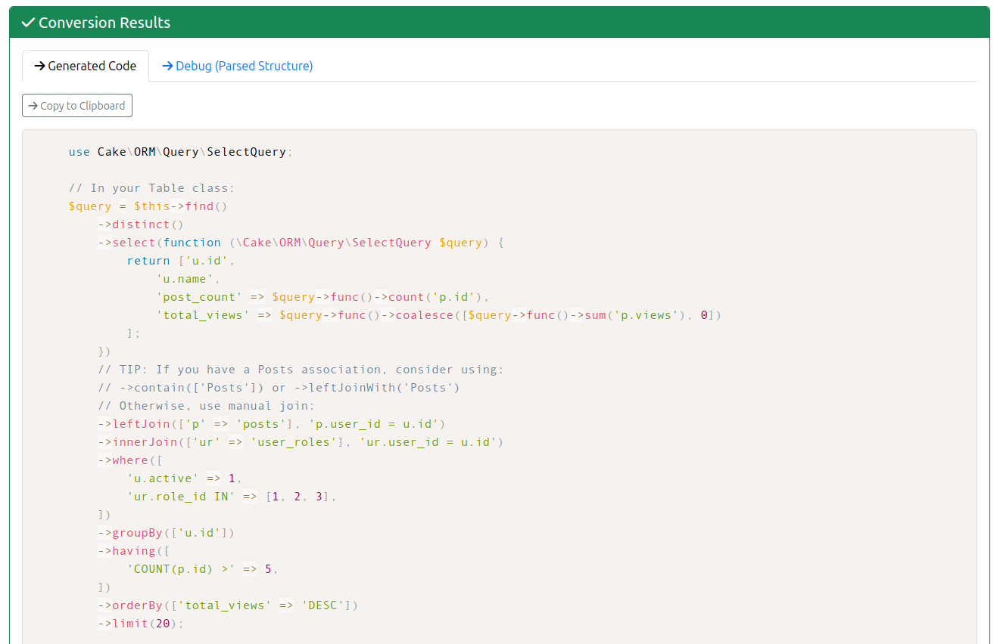

# SQL to Query Builder Converter (v2.0)

Convert raw SQL queries to clean, production-ready CakePHP Query Builder code with just a few clicks!

## Quick Start

Navigate to `/test-helper/query-builder` in your browser to access the converter.




## Features

### Supported Query Types

* **SELECT** - Full support with all clauses
* **INSERT** - Single and bulk (multiple rows)
* **UPDATE** - Single and multi-table with JOINs
* **DELETE** - With complex WHERE conditions

### SQL Functions

#### String Functions
* `CONCAT()` → `$query->func()->concat([])`
* `SUBSTRING()` / `SUBSTR()` → `$query->func()->substring([])`
* `TRIM()`, `LTRIM()`, `RTRIM()` → `$query->func()->trim()`
* `UPPER()` / `LOWER()` → `$query->func()->upper()` / `lower()`
* `COALESCE()` → `$query->func()->coalesce([])`
* `LENGTH()` → `$query->func()->length()`
* `REPLACE()` → Guidance provided

#### Date Functions
* `NOW()`, `CURDATE()`, `CURTIME()` → `$query->func()->now()`
* `YEAR()`, `MONTH()`, `DAY()` → `$query->func()->year()` etc.
* `DATEDIFF()` → `$query->func()->dateDiff([])`
* `DATE_FORMAT()` → Guidance for FrozenTime
* `DATE_ADD()`, `DATE_SUB()` → Guidance provided

#### Aggregate Functions
* `COUNT()`, `SUM()`, `AVG()`, `MIN()`, `MAX()` → `$query->func()->`
* `GROUP_CONCAT()` → `$query->func()->groupConcat()`

### Advanced Features

#### CASE Expressions ✅
Converts SQL CASE/WHEN/THEN/ELSE to QueryExpression:

**SQL:**
```sql
CASE
    WHEN status = 1 THEN 'Active'
    WHEN status = 2 THEN 'Pending'
    ELSE 'Inactive'
END AS status_label
```

**Generated:**
```php
'status_label' => $query->newExpr()->case()
    ->when(['status' => 1])
    ->then('Active')
    ->when(['status' => 2])
    ->then('Pending')
    ->else('Inactive')
```

#### Subqueries ✅
Recursively parses and generates subquery code:

**SQL:**
```sql
SELECT * FROM users
WHERE id IN (SELECT user_id FROM active_sessions)
```

**Generated:**
```php
$subquery1 = $this->find()
    ->select(['user_id'])
    ->from('active_sessions');

$query = $this->find()
    ->where(['id IN' => $subquery1]);
```

#### Window Functions
Detects and provides guidance (limited CakePHP 5.x support):
* `ROW_NUMBER()` OVER (...)
* `RANK()`, `DENSE_RANK()`
* `PARTITION BY`, `ORDER BY`
* `LAG()`, `LEAD()`, `FIRST_VALUE()`, `LAST_VALUE()`

#### CTEs (Common Table Expressions)
Parses WITH clauses and suggests alternatives:
* Subquery alternatives
* Raw SQL option
* Separate query approach

### Complex JOINs

Handles all JOIN types with complex conditions:
* `INNER JOIN` → `->innerJoin()`
* `LEFT JOIN` → `->leftJoin()`
* `RIGHT JOIN` → `->rightJoin()`
* Multiple JOINs with table aliases
* Complex ON conditions with AND/OR

**Example:**
```sql
LEFT JOIN posts AS p ON p.user_id = u.id AND p.status = 'published'
```

Generates:
```php
->leftJoin(['p' => 'posts'], 'p.user_id = u.id AND p.status = \'published\'')
```

### Multi-table UPDATE

Detects UPDATE queries with JOINs and provides transaction-based approach:

**SQL:**
```sql
UPDATE users u
JOIN profiles p ON p.user_id = u.id
SET u.last_login = NOW(), p.updated = NOW()
WHERE u.id = 5
```

**Generated:**
```php
$this->getConnection()->transactional(function () {
    $this->UsersTable->updateAll([...], [...]);
    $this->ProfilesTable->updateAll([...], [...]);
});
```

## User Interface

### Syntax Highlighting

* **SQL Input** - Color-coded SQL syntax with Prism.js
* **PHP Output** - Highlighted CakePHP code with line numbers
* **Examples** - All examples syntax highlighted

### Tabbed Interface

**Results Tabs:**
1. **Generated Code** - The converted CakePHP code
2. **Debug (Parsed Structure)** - Internal parser output for troubleshooting

**Example Tabs:**
1. **SELECT** - 8 examples from simple to complex
2. **INSERT** - 3 examples including bulk
3. **UPDATE** - 4 examples including CASE and multi-table
4. **DELETE** - 3 examples with complex WHERE
5. **Advanced** - 4 examples (window functions, CTEs, nested subqueries)

### Interactive Examples

Each example includes:
* SQL code with syntax highlighting
* **"Try It" button** - Loads SQL into the converter
* Collapsible sections for cleaner UI

## Common Patterns

### Converting Existing SQL

1. Copy your SQL query from your application
2. Paste into the SQL textarea
3. Click "Convert to CakePHP"
4. Review the generated code
5. Copy to clipboard and paste into your Table class

### Learning Query Builder

1. Browse the tabbed examples
2. Click "Try It" on an example similar to your use case
3. See how SQL patterns translate to CakePHP
4. Modify the SQL and re-convert to experiment

### Migrating Legacy Code

1. Find raw SQL queries in your legacy application
2. Convert them one-by-one using the tool
3. Review generated code for best practices
4. Test in your application
5. Refactor further as needed

## Tips & Best Practices

### When to Use Generated Code

✅ **Good for:**
* Quick prototyping
* Learning Query Builder syntax
* Converting legacy SQL
* Understanding complex query patterns
* Starting point for refactoring

⚠️ **Review needed:**
* Multi-table queries (consider associations)
* Complex expressions (test thoroughly)
* Performance-critical queries (may need optimization)

### Association-Based Alternatives

The generator suggests association alternatives when appropriate:

```php
// Manual join (generated)
->leftJoin(['Posts' => 'posts'], 'posts.user_id = users.id')

// TIP: If you have a Posts association, consider using:
// ->contain(['Posts']) or ->leftJoinWith('Posts')
```

### ORM Alias Handling

The converter automatically normalizes table aliases:

**SQL:**
```sql
SELECT authors.id AS Authors__id, authors.name
FROM authors AS Authors
```

**Generated (simplified):**
```php
->select(['Authors.id', 'Authors.name'])
// TIP: ORM-style aliases detected. Consider using:
// ->contain() or ->leftJoinWith() for automatic aliasing
```

## Limitations

### Database-Specific Features

* **Focus**: MySQL syntax
* **Future**: PostgreSQL, SQLite support planned (Phase 5)

### Not Supported

* Multi-table DELETE (CakePHP limitation)
* Some vendor-specific functions
* Very complex nested expressions (may need manual adjustment)
* User-defined functions (UDFs)

### Partial Support (with Guidance)

* Window functions (limited CakePHP 5.x native support)
* CTEs (suggests subquery alternatives)
* Some date/time functions (provides guidance)

## Troubleshooting

### Empty Generated Code

* Check SQL syntax is valid
* Ensure query type is supported (SELECT, INSERT, UPDATE, DELETE)
* Review error messages if any

### Unexpected Output

* Use the **Debug tab** to see parsed structure
* Check for SQL syntax quirks (comments, special characters)
* Try simplifying the query first

### Complex Queries

* Break into smaller parts
* Convert step-by-step
* Use Debug tab to understand parsing
* Manually combine generated code

## Examples

### Example 1: Simple SELECT with Functions

**SQL:**
```sql
SELECT
    CONCAT(first_name, ' ', last_name) AS full_name,
    UPPER(email) AS email_upper,
    YEAR(created) AS signup_year
FROM users
WHERE active = 1
ORDER BY created DESC
LIMIT 10
```

**Generated:**
```php
$query = $this->find()
    ->select(function (\Cake\ORM\Query\SelectQuery $query) {
        return [
            'full_name' => $query->func()->concat(['first_name', "' '", 'last_name']),
            'email_upper' => $query->func()->upper('email'),
            'signup_year' => $query->func()->year(['created'])
        ];
    })
    ->where(['active' => 1])
    ->orderBy(['created' => 'DESC'])
    ->limit(10);
```

### Example 2: Complex JOIN with Aggregates

**SQL:**
```sql
SELECT
    u.id,
    u.name,
    COUNT(p.id) AS post_count,
    COALESCE(SUM(p.views), 0) AS total_views
FROM users u
LEFT JOIN posts p ON p.user_id = u.id
WHERE u.active = 1
GROUP BY u.id
HAVING COUNT(p.id) > 5
ORDER BY total_views DESC
```

**Generated:**
```php
$query = $this->find()
    ->select(function (\Cake\ORM\Query\SelectQuery $query) {
        return [
            'u.id',
            'u.name',
            'post_count' => $query->func()->count('p.id'),
            'total_views' => $query->func()->coalesce([
                $query->func()->sum('p.views'),
                0
            ])
        ];
    })
    ->leftJoin(['p' => 'posts'], 'p.user_id = u.id')
    ->where(['u.active' => 1])
    ->groupBy(['u.id'])
    ->having(['COUNT(p.id) >' => 5])
    ->orderBy(['total_views' => 'DESC']);
```

### Example 3: UNION Query

**SQL:**
```sql
SELECT id, name, 'user' AS type FROM users WHERE active = 1
UNION
SELECT id, name, 'admin' AS type FROM admins WHERE active = 1
ORDER BY name
```

**Generated:**
```php
$query1 = $this->find()
    ->select(['id', 'name', 'type' => '\'user\''])
    ->where(['active' => 1]);

$query2 = $this->find()
    ->select(['id', 'name', 'type' => '\'admin\''])
    ->from('admins')
    ->where(['active' => 1]);

$query = $query1->union($query2)
    ->orderBy(['name' => 'ASC']);
```

## Advanced Topics

### Nested Function Calls

Automatically handles nested functions:

```sql
SELECT COALESCE(SUM(amount), 0) AS total
```

Generates:
```php
'total' => $query->func()->coalesce([
    $query->func()->sum('amount'),
    0
])
```

### Multiline CASE Expressions

Properly handles CASE across multiple lines:

```sql
SELECT
    CASE
        WHEN score >= 90 THEN 'A'
        WHEN score >= 80 THEN 'B'
        WHEN score >= 70 THEN 'C'
        ELSE 'F'
    END AS grade
FROM students
```

### Bulk INSERT

Generates both entity-based and query-based approaches:

```sql
INSERT INTO users (username, email) VALUES
    ('alice', 'alice@example.com'),
    ('bob', 'bob@example.com')
```

Provides `saveMany()` and `->values()` options.

## Technical Details

### Architecture

* **SqlParser** - Parses raw SQL into structured arrays
* **QueryBuilderGenerator** - Converts parsed structure to CakePHP code
* **ConditionParser** - Handles complex WHERE/HAVING conditions

### Regex Modifiers

* Uses `/s` modifier for multiline expressions (CASE, etc.)
* Uses `/i` for case-insensitive matching
* Handles nested parentheses and quotes

### Type Detection

Automatically detects field types:
* `column` - Simple field reference
* `aggregate` - COUNT, SUM, etc.
* `string_func` - CONCAT, TRIM, etc.
* `date_func` - NOW, YEAR, etc.
* `case` - CASE expressions
* `math` - Mathematical expressions
* `window_func` - Window functions

## Version History

### v2.0 (Current)
* ✅ String/Date function conversion
* ✅ CASE expression builder
* ✅ Recursive subquery generation
* ✅ Multi-table UPDATE support
* ✅ Window function detection
* ✅ CTE parsing
* ✅ Syntax highlighting
* ✅ Tabbed UI
* ✅ Bug fixes (alias order, JOIN syntax, multiline parsing)

### v1.2
* ✅ Complex expressions
* ✅ UNION queries
* ✅ Bulk INSERT
* ✅ EXISTS/NOT EXISTS
* ✅ ORM alias detection

### v1.1
* ✅ WHERE/HAVING condition parser
* ✅ JOIN support
* ✅ Association suggestions

### v1.0 (MVP)
* ✅ Basic SELECT, INSERT, UPDATE, DELETE
* ✅ Web UI
* ✅ Dashboard integration

## Further Reading

* [CakePHP Query Builder Docs](https://book.cakephp.org/5/en/orm/query-builder.html) - Official documentation

## Contributing

Found a bug or have a feature request? The SQL converter is actively maintained!

**Key areas for contribution:**
* Database dialect support (PostgreSQL, SQLite)
* Additional SQL functions
* UI improvements
* Test coverage for edge cases
