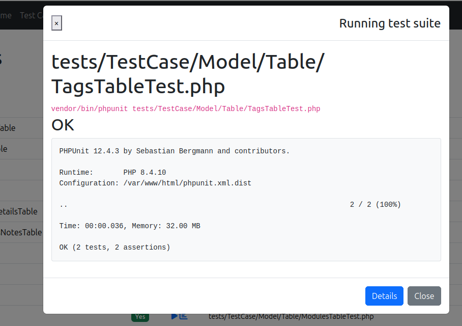

# Test Runner

Run your test suites from the backend and view the results — or coverage — without leaving
the browser.

Select the app or a plugin, choose the type of classes you want to test, then click the
**run** icon.

::: tip
If a class has no test file yet, an **add** icon appears next to it — click it to bake the
test for you.
:::



## Configuration

```php
'TestHelper' => [
    // Custom phpunit command. Both `php phpunit.phar` and `vendor/bin/phpunit` work out of the box.
    'command' => null,
    // Set to 'xdebug' if you have it enabled; otherwise pcov is used by default.
    'coverage' => null,
],
```

See [Configuration](/Configuration) for the full list of options.

::: warning
If the coverage report renders in black & white, your web server may be blocking hidden
files (the assets). See [Troubleshooting](/Troubleshooting#coverage-report-is-black-white).
:::
