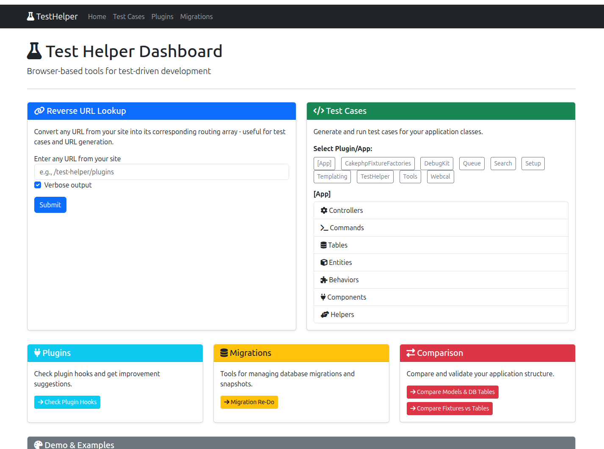

# Overview

TestHelper adds a browseable developer backend at `/test-helper` for your CakePHP app,
collecting several day-to-day tools in one place.



::: tip
Everything here is a development aid — mount it behind your admin/dev gate. See
[Configuration](/configuration) for the authorization and back-link options.
:::

## Tools

| Tool | What it does |
|------|--------------|
| [Association vs DB Audit](/associations) | Compare declared associations against the real database foreign keys, with copy-paste fixes |
| [SQL to Query Builder](/sql-converter) | Convert raw SQL into CakePHP Query Builder code |
| [Test Runner](/test-runner) | Run tests and view results/coverage in the backend; bake missing test files |
| [Fixture Check](/fixture-check) | Compare fixtures against the live DB schema |
| [URL Tools](/url-tools) | Generate URL arrays from string URLs (reverse lookup) |
| [Plugin Info](/plugins) | Inspect plugins, their hooks, and suggested improvements |
| [Custom Linter Tasks](/linter) | Project-specific code-quality checks via `bin/cake linter` |

## Requirements

* PHP 8.2+
* CakePHP 5.1+

## Installation

```bash
composer require --dev dereuromark/cakephp-test-helper
```

Load the plugin (development only):

```php
// src/Application.php
public function bootstrap(): void
{
    parent::bootstrap();

    if (Configure::read('debug')) {
        $this->addPlugin('TestHelper');
    }
}
```

Then browse to `/test-helper`.

See [Configuration](/configuration) for the available options and
[Troubleshooting](/troubleshooting) if something doesn't render.
